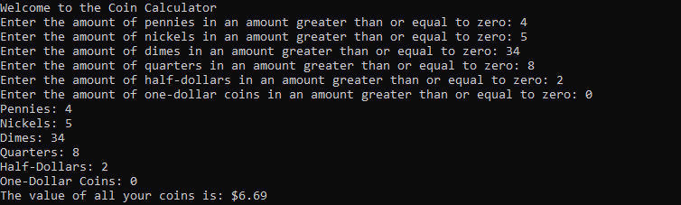

# Coin Calculator
 This is a simple program that accepts integer input from the user, calculates the input together, and outputs a formatted result
 
 ## Flow of Code
 
 * Assigns the generic coin values to variables within the program(pennies, nickels, etc...) as well as  half and one-dollar coins
 * Accepts integers from user that is separated into the individual coin types
 * Sums the amounts of the coins into one amount
 * Outputs the amount into an expected format: $10.25, $4.32, etc...
 
 ```C++
 if ((penny_amount < 0) || (nickel_amount < 0) || (dime_amount < 0) || (quarter_amount < 0) || (halfdollar_amount < 0) || (onedollar_amount < 0)) {
			cout << "Error: Please enter a positive number" << endl;
			valid = 1;
		}
		else {
			valid = 0;
		}
 ```
 Basic input validation ensuring that no negative amounts of money are mistakenly added into the end result.
 ## Example Output
 
